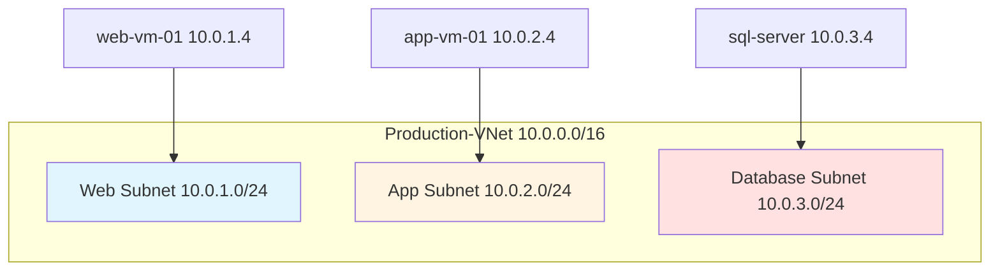
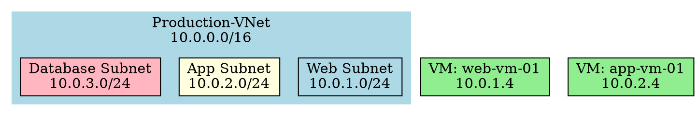
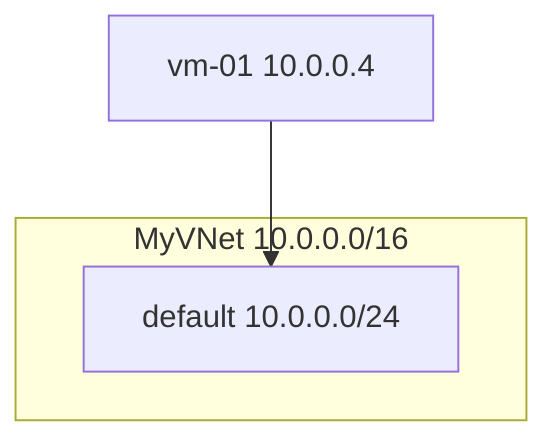
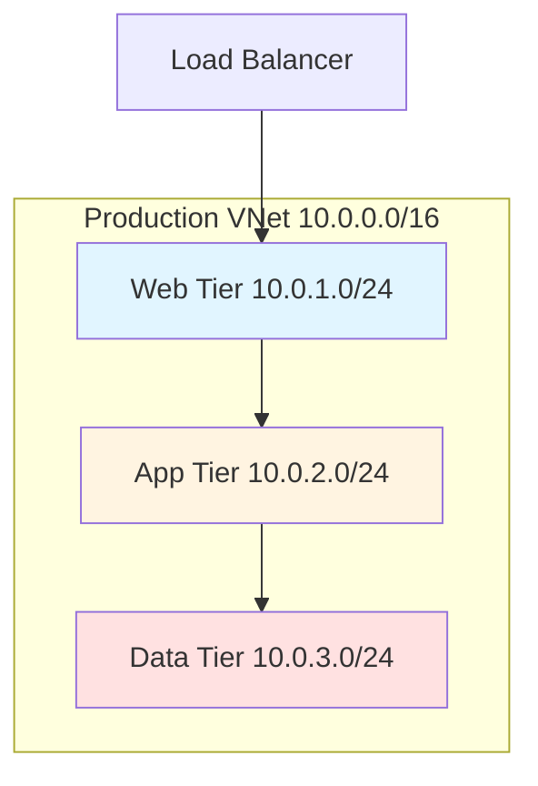
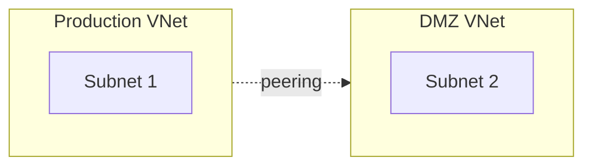

# Network Diagrams

## Overview

The Azure Audit Tool automatically generates **network topology diagrams** in two formats:

1. **Mermaid diagrams** (embedded in markdown reports)
2. **Graphviz DOT files** (convertible to PNG, SVG, PDF)

## 🎨 What Gets Diagrammed

### Network Topology
- Virtual Networks (VNets) with address spaces
- Subnets with CIDR blocks
- VNet Peering connections
- Virtual Machines placement
- Load Balancers
- VPN Gateways
- Azure Firewalls

### Visual Features
- **Color coding** by subnet type (Web, App, Database)
- **Hierarchical layout** (VNets → Subnets → Resources)
- **Connection lines** for peering and dependencies
- **Resource labels** with IPs and configurations

## 📁 Output Files

After running an audit, diagrams are generated in `docs/diagrams/`:

```
docs/diagrams/
├── network_Production.mermaid.md      # Mermaid diagram for Production
├── network_Production.dot             # Graphviz DOT file for Production
├── network_Production.png             # PNG image (after rendering)
├── network_Production.svg             # SVG image (after rendering)
├── network_Development.mermaid.md     # Mermaid for Development
├── network_Development.dot            # DOT for Development
└── network_overview.mermaid.md        # Overall network overview
```

## 🚀 Usage

### Automatic Generation

Diagrams are automatically generated when you run an audit:

```bash
./audit-azure.sh
```

The networking report (`docs/resources/networking.md`) will include embedded Mermaid diagrams that render on GitHub!

### Render to Images

To convert DOT files to PNG/SVG images:

```bash
# Render all diagrams to PNG and SVG
python3 scripts/render_diagrams.py

# Render to specific formats
python3 scripts/render_diagrams.py docs/diagrams png,svg,pdf

# Specify custom directory
python3 scripts/render_diagrams.py /path/to/diagrams png
```

**Prerequisites:** Install Graphviz first:
```bash
# macOS
brew install graphviz

# Linux
sudo apt-get install graphviz

# Windows
# Download from https://graphviz.org/download/
```

## 📊 Diagram Formats

### 1. Mermaid Diagrams

**Embedded in Markdown Reports**

Mermaid diagrams are included directly in your markdown documentation and render automatically on GitHub, GitLab, and other platforms.

**Example:**
````markdown
## Network Topology Diagram


````

**Viewing:**
- GitHub/GitLab: Renders automatically
- VS Code: Use Mermaid preview extension
- Obsidian, Notion: Native support
- Online: https://mermaid.live/

### 2. Graphviz DOT Files

**Convertible to Multiple Formats**

DOT files can be rendered to:
- **PNG** - For documents and presentations
- **SVG** - Scalable vector graphics
- **PDF** - For printing
- **Interactive HTML** - With graphviz-webcomponents

**Example DOT file:**


**Manual Rendering:**
```bash
# Convert to PNG
dot -Tpng network_Production.dot -o network_Production.png

# Convert to SVG
dot -Tsvg network_Production.dot -o network_Production.svg

# Convert to PDF
dot -Tpdf network_Production.dot -o network_Production.pdf
```

## 🎨 Color Coding

Diagrams use color coding to identify resource types:

| Color | Resource Type | Hex Code |
|-------|--------------|----------|
| 🔵 Light Blue | Web/Frontend subnets | `#e1f5ff` |
| 🟡 Light Yellow | Application subnets | `#fff4e1` |
| 🔴 Light Pink | Database subnets | `#ffe1e1` |
| 🟢 Light Green | Virtual Machines | `#90EE90` |
| 💗 Pink | Load Balancers | `#FFB6C1` |
| 💜 Purple | VPN Gateways | `#DDA0DD` |
| 🟠 Tomato | Firewalls | `#FF6347` |

## 📖 Examples

### Example 1: Simple VNet



### Example 2: Multi-Tier Architecture



### Example 3: VNet Peering



## 🔧 Customization

### Modify Diagram Generator

Edit `scripts/utils/diagram_generator.py` to:
- Change colors
- Add more resource types
- Modify layout
- Include additional details

### Custom Graphviz Options

When rendering, you can use Graphviz options:

```bash
# Horizontal layout
dot -Grankdir=LR -Tpng network.dot -o network.png

# Change node spacing
dot -Gnodesep=1.0 -Tpng network.dot -o network.png

# High DPI for printing
dot -Gdpi=300 -Tpng network.dot -o network.png
```

## 📱 Viewing Diagrams

### In Browser
```bash
# Open PNG in default viewer
open docs/diagrams/network_Production.png

# Open all diagrams
open docs/diagrams/*.png
```

### In VS Code
- Install "Markdown Preview Mermaid Support" extension
- Open `.mermaid.md` files
- Click preview button

### Online
- Upload DOT files to: https://dreampuf.github.io/GraphvizOnline/
- Paste Mermaid code to: https://mermaid.live/

### In Documentation Tools
- **Confluence**: Supports Mermaid via plugins
- **GitHub Pages**: Renders Mermaid automatically
- **MkDocs**: With mermaid2 plugin
- **Sphinx**: With sphinxcontrib-mermaid

## 💡 Use Cases

### 1. Documentation
- Include PNG diagrams in Word/PowerPoint
- Embed SVG in HTML documentation
- Use Mermaid in Markdown wikis

### 2. Presentations
- Export to PDF for slides
- Include in architecture reviews
- Share with stakeholders

### 3. Compliance
- Network topology for audit reports
- Security zone diagrams
- Data flow visualization

### 4. Planning
- Visualize current state
- Plan migrations
- Design changes

### 5. Troubleshooting
- Understand connectivity
- Identify dependencies
- Trace traffic flows

## 🚨 Troubleshooting

### Diagrams Not Generated

**Check the logs:**
```bash
grep -i diagram logs/azure_audit_*.log
```

**Common issues:**
- No VNets in subscription
- Permission errors
- Python import errors

### Graphviz Not Rendering

**Install Graphviz:**
```bash
# macOS
brew install graphviz

# Verify installation
dot -V
```

**Check PATH:**
```bash
which dot
```

### Mermaid Not Rendering

**On GitHub:**
- Ensure you're viewing on GitHub (not raw)
- Check syntax with https://mermaid.live/

**In VS Code:**
- Install "Markdown Preview Mermaid Support"
- Reload VS Code

## 📚 Resources

### Mermaid
- Documentation: https://mermaid.js.org/
- Live Editor: https://mermaid.live/
- GitHub Support: https://github.blog/2022-02-14-include-diagrams-markdown-files-mermaid/

### Graphviz
- Documentation: https://graphviz.org/documentation/
- Gallery: https://graphviz.org/gallery/
- Online Editor: https://dreampuf.github.io/GraphvizOnline/

## 🎯 Tips

1. **Always render diagrams after audits** to have visual documentation
2. **Use SVG for web** - scalable and smaller file size
3. **Use PNG for presentations** - universally compatible
4. **Check GitHub rendering** - Mermaid diagrams display automatically
5. **Archive old diagrams** - Track infrastructure changes over time

## 🔄 Workflow

### Complete Workflow

```bash
# 1. Run audit (generates diagrams automatically)
./audit-azure.sh

# 2. Render DOT files to images
python3 scripts/render_diagrams.py

# 3. View results
open docs/resources/networking.md              # View embedded Mermaid
open docs/diagrams/network_Production.png      # View PNG image

# 4. Commit to version control (optional)
git add docs/diagrams/*.svg docs/diagrams/*.dot
git commit -m "Update network diagrams"
```

### Scheduled Updates

```bash
#!/bin/bash
# weekly-audit.sh

# Run audit
./audit-azure.sh

# Render diagrams
python3 scripts/render_diagrams.py

# Archive with date
DATE=$(date +%Y%m%d)
cp -r docs/diagrams docs/diagrams_$DATE

# Commit
git add docs/
git commit -m "Weekly audit - $DATE"
git push
```

---

**Enjoy your automatically generated network diagrams!** 🎨

For questions or issues, see the main [README.md](README.md).
