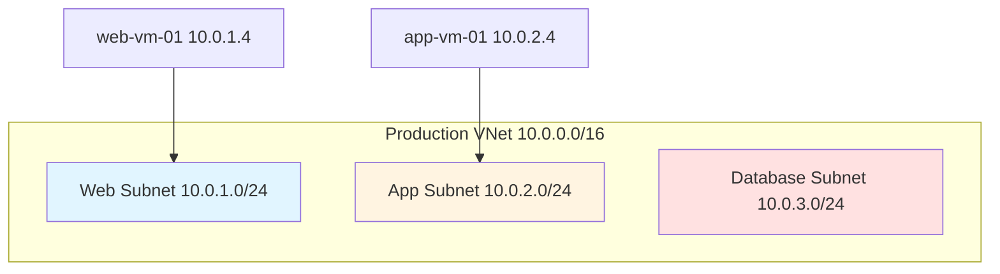
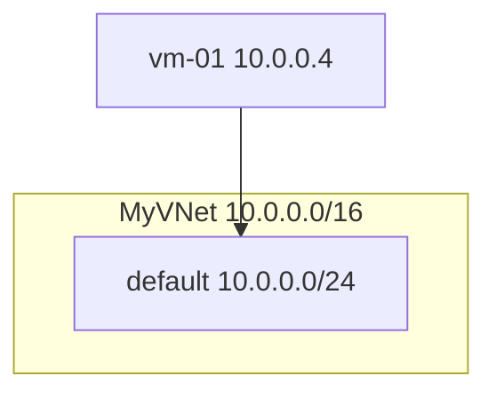
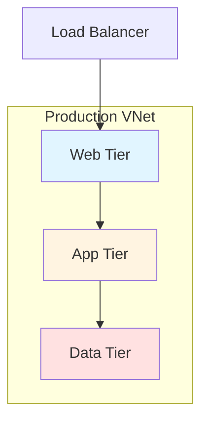

# 🎨 Network Diagram Features - Summary

## ✅ What Was Added

I've implemented **automatic network diagram generation** that creates visual representations of your Azure infrastructure in two formats!

### 1. **Mermaid Diagrams** (Embedded in Markdown)
- ✅ Automatically included in networking reports
- ✅ Renders on GitHub, GitLab, VS Code
- ✅ No external tools needed to view
- ✅ Perfect for documentation

### 2. **Graphviz DOT Files** (Exportable Images)
- ✅ Can be converted to PNG, SVG, PDF
- ✅ High-quality graphics for presentations
- ✅ Scalable vector format
- ✅ Professional diagrams

## 🎯 How It Works

### Automatic During Audit

When you run an audit, diagrams are **automatically generated**:

```bash
./audit-azure.sh
```

**What gets created:**
```
docs/
├── resources/
│   └── networking.md          ← Includes embedded Mermaid diagram!
└── diagrams/                  ← New directory!
    ├── network_Production.mermaid.md    ← Mermaid diagram
    ├── network_Production.dot           ← Graphviz DOT file
    └── network_overview.mermaid.md      ← Overall topology
```

### View Embedded Diagrams

The networking report now includes visual diagrams:

**Open:** `docs/resources/networking.md`

**On GitHub:** Diagrams render automatically!

**Example:**


### Render to Images

Convert DOT files to PNG/SVG:

```bash
# Install Graphviz first
brew install graphviz

# Render all diagrams
python3 scripts/render_diagrams.py
```

**Output:**
```
docs/diagrams/
├── network_Production.png    ← PNG image
├── network_Production.svg    ← SVG vector graphic
├── network_Production.dot    ← Source file
└── network_Production.mermaid.md
```

## 🎨 What Gets Visualized

The diagrams show:

### Network Structure
- ✅ **VNets** with address spaces (e.g., 10.0.0.0/16)
- ✅ **Subnets** with CIDR blocks (e.g., 10.0.1.0/24)
- ✅ **VNet Peering** connections between networks
- ✅ **Virtual Machines** with IP addresses
- ✅ **Load Balancers** and their configurations
- ✅ **VPN Gateways** and network gateways

### Color Coding
- 🔵 **Blue** - Web/Frontend subnets
- 🟡 **Yellow** - Application subnets
- 🔴 **Pink** - Database subnets
- 🟢 **Green** - Virtual Machines
- 💗 **Pink** - Load Balancers

## 📊 Example Diagrams

### Simple VNet



### Multi-Tier Architecture



## 🚀 Usage Examples

### Example 1: Basic Audit with Diagrams

```bash
# Run audit (diagrams created automatically)
./audit-azure.sh

# View embedded diagram in markdown
open docs/resources/networking.md
```

### Example 2: Create PNG Images

```bash
# Run audit
./audit-azure.sh

# Install Graphviz
brew install graphviz

# Render diagrams to images
python3 scripts/render_diagrams.py

# View PNG
open docs/diagrams/network_Production.png
```

### Example 3: View on GitHub

```bash
# Commit and push
git add docs/
git commit -m "Update network documentation"
git push

# View on GitHub - Mermaid diagrams render automatically!
```

### Example 4: Include in Presentation

```bash
# Generate high-resolution PNG
cd docs/diagrams
dot -Gdpi=300 -Tpng network_Production.dot -o network_Production_hires.png

# Use in PowerPoint/Keynote
```

## 📁 File Types

| File Type | Purpose | How to View |
|-----------|---------|-------------|
| `.mermaid.md` | Mermaid diagram | GitHub, VS Code, Obsidian |
| `.dot` | Graphviz source | Text editor |
| `.png` | Raster image | Any image viewer |
| `.svg` | Vector graphic | Browser, Illustrator |
| `.pdf` | Printable | PDF viewer |

## 🛠️ Tools & Commands

### View Mermaid Diagrams

**GitHub/GitLab:**
- Renders automatically in markdown files

**VS Code:**
```bash
# Install extension
code --install-extension bierner.markdown-mermaid

# Open file
code docs/diagrams/network_Production.mermaid.md
```

**Online:**
- Paste code at https://mermaid.live/

### Render Graphviz Diagrams

**Automatic (using script):**
```bash
python3 scripts/render_diagrams.py
```

**Manual:**
```bash
# To PNG
dot -Tpng network.dot -o network.png

# To SVG
dot -Tsvg network.dot -o network.svg

# To PDF
dot -Tpdf network.dot -o network.pdf

# High DPI PNG
dot -Gdpi=300 -Tpng network.dot -o network_hires.png
```

## 💡 Use Cases

### 1. Documentation
- Include diagrams in wikis
- GitHub README files
- Technical documentation
- Architecture decision records

### 2. Presentations
- Export to PNG for PowerPoint
- Use SVG for web presentations
- Print to PDF for handouts

### 3. Compliance & Audits
- Network topology for SOC2
- Security zone diagrams
- Data flow visualization
- Audit trail documentation

### 4. Planning & Design
- Visualize current state
- Plan migrations
- Design changes
- Capacity planning

### 5. Troubleshooting
- Understand connectivity
- Identify dependencies
- Trace traffic flows
- Debug network issues

## 📚 New Files Created

**Scripts:**
- `scripts/utils/diagram_generator.py` - Generates both Mermaid and Graphviz diagrams
- `scripts/render_diagrams.py` - Converts DOT to PNG/SVG/PDF

**Documentation:**
- `DIAGRAMS.md` - Complete diagram documentation
- `DIAGRAM_FEATURES.md` - This file (quick reference)

**Updated:**
- `scripts/reports/markdown_generator.py` - Now includes Mermaid diagrams in networking reports

## 🎓 Quick Start

### 1. Run Your First Audit with Diagrams

```bash
# Authenticate
az login

# Run audit
./audit-azure.sh

# Check the networking report
open docs/resources/networking.md
```

**You'll see:** Embedded Mermaid diagram showing your network topology!

### 2. Generate PNG Images

```bash
# Install Graphviz
brew install graphviz

# Render diagrams
python3 scripts/render_diagrams.py

# View images
open docs/diagrams/*.png
```

### 3. View on GitHub

```bash
# Push to GitHub
git add docs/
git commit -m "Add network diagrams"
git push

# Visit your repo on GitHub
# Mermaid diagrams will render automatically!
```

## 🔧 Customization

Want to customize the diagrams? Edit:
- `scripts/utils/diagram_generator.py` - Change colors, layout, content
- Modify the `colors` dictionary for different color schemes
- Add more resource types to visualize

## 📖 Full Documentation

For complete documentation, see:
- **[DIAGRAMS.md](DIAGRAMS.md)** - Complete guide with examples
- **[README.md](README.md)** - Main documentation
- **[EXAMPLES.md](EXAMPLES.md)** - Usage examples

## ✅ Summary

**What you get:**
- ✅ Automatic network diagram generation
- ✅ Mermaid diagrams in markdown (renders on GitHub!)
- ✅ Graphviz DOT files for PNG/SVG/PDF export
- ✅ Color-coded topology diagrams
- ✅ VNet, subnet, and resource visualization
- ✅ Professional graphics for presentations

**How to use:**
```bash
# Just run the audit - diagrams created automatically!
./audit-azure.sh

# Optional: Render to images
python3 scripts/render_diagrams.py
```

**All changes pushed to GitHub:**
https://github.com/billybeckett/Audit-Azure

---

🎨 **Enjoy your automatically generated network diagrams!**
